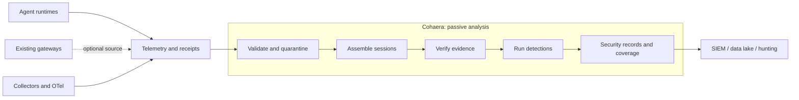

<!--
  Copyright 2026 Imran Hafeez
  SPDX-License-Identifier: Apache-2.0
-->

# Cohaera

**Security monitoring and detection engineering for AI agent activity.**

Cohaera aims to do for AI agent telemetry what Zeek does for network traffic:
turn an event stream into structured security records, session-level
detections, and an explicit account of what could not be observed.

It is pre-alpha research software. The Zeek comparison describes the operating
model and direction, not the current maturity.

## Passive by design

**Cohaera is not an AI gateway.** It does not proxy prompts, approve tool calls,
block actions, run agents, or sit in their availability path.

Agents and collectors emit telemetry. Cohaera reads that telemetry out of band,
reconstructs sessions, checks the evidence, runs deterministic detections, and
emits records for a SIEM, data lake, or investigation workflow. A gateway may
be one telemetry source, but Cohaera does not depend on one.



## Why it exists

Agent logs create two security questions:

1. Did the session contain suspicious behaviour?
2. Was there enough trustworthy evidence to answer the first question?

Most detection pipelines answer the first and silently assume the second.
Cohaera keeps them separate. Each check returns `evaluated`, `degraded`, or
`not_evaluated` with machine-readable reasons. Missing evidence cannot become a
clean result.

The project concentrates on security problems that prompt filters and inline
policy controls do not settle:

- multi-event sequences across a complete agent session;
- consequential tool use after untrusted content or a guardrail event;
- actions omitted from the agent's final account;
- missing, reordered, modified, replayed, or unsigned telemetry;
- approvals that do not bind to the exact action performed;
- claimed failures contradicted by provider-returned effect receipts;
- detection blind spots caused by absent fields, unknown tools, or weak
  correlation.

## Try it in five minutes

The local lab needs only Python 3.10–3.13. It uses no network, VM, API key, or
package installation.

```bash
git clone https://github.com/404SecNotFound/Cohaera.git
cd Cohaera

python3 lab/local/run.py --check
cat lab/local/runs/latest/RESULTS.md
```

That run exercises six states of one workflow: normal behaviour, a suspicious
sequence, evidence failure, an outcome contradiction, a partially bound
receipt, and partial attestation. It also tests replay, stream forks, and the
coverage gained from a capability manifest, collector key, and correlation
secret.

Then run the independent evidence-integrity matrix:

```bash
python3 lab/ch06/run.py --check
```

It applies nine declared conditions to one signed stream and compares Cohaera
with a separate standard-library verifier. Both parse the same committed JSONL
bytes.

For a guided tour of the inputs, output, code path, and experiments, follow the
**[operator guide](docs/OPERATOR-GUIDE.md)**.

## Score telemetry

Install the command locally:

```bash
python3 -m venv .venv
source .venv/bin/activate
python -m pip install -e .
python tests/make_fixtures.py
```

Score a suspect stream against a benign sequence baseline:

```bash
cohaera score tests/fixtures/suspect.jsonl \
  --baseline tests/fixtures/benign.jsonl > verdicts.jsonl
```

Add the inputs that make stronger conclusions possible:

```bash
export COHAERA_CORRELATION_SECRET='replace-with-a-lab-secret'

cohaera score agent-telemetry.jsonl \
  --baseline benign-telemetry.jsonl \
  --tool-manifest capability-manifest.json \
  --trust-store trust-store.json \
  --seen-streams seen-streams.json \
  --seen-approvals seen-approvals.json \
  --evidence-max-age 3600 \
  --reject-log quarantine.jsonl \
  --max-reject-ratio 0.01 > verdicts.jsonl
```

JSONL verdicts go to stdout. Human findings and coverage gaps go to stderr, so
the machine-readable stream can be piped directly into another security tool.
Exit codes distinguish a complete run, partial quarantine, strict rejection,
and incomplete output.

## What it emits

Cohaera currently emits one `cohaera_session_verdict` per assembled session.
Each record contains:

- stable run, verdict, agent, trace, and session identity;
- derived tool sequence, effects, timing, cost, and call pairing;
- findings with severity and supporting evidence;
- `evidence_status`, from `verified_complete` through `inadmissible`;
- a coverage contract for every CH01–CH07 check;
- configuration and input provenance for reproduction and deduplication.

With `--emit-tool-records` it also emits one `cohaera_tool` activity record per
tool call: a durable fact about what ran, with class, pairing state, approval
and receipt binding, queryable on its own with no detection loaded. This is the
first record of the activity family, kept apart from the verdict the way Zeek's
`conn.log` is kept apart from `notice.log`. See
**[activity records](docs/ACTIVITY-RECORDS.md)** for the fields, their null
semantics, and the hunts they answer.

The longer-term record model is described in
**[project direction](docs/DIRECTION.md)**. The intended shape is a small set of
stable activity logs plus notices, similar to the separation between Zeek's
protocol logs and its notice stream.

## Detections available today

| ID | Security question |
|---|---|
| **CH01** `sequence_order` | Is the tool sequence novel relative to an operator-supplied benign grammar? |
| **CH02** `concealment_gap` | Did a consequential action succeed without appearing in the agent's final account? |
| **CH03** `untrusted_to_consequential` | Did consequential work follow observed untrusted content? |
| **CH04** `guardrail_overrun` | Did work continue after a guardrail, and was a declared blocking control bypassed? |
| **CH05** `unpaired_calls` | Did a consequential call start without a terminal event? |
| **CH06** `evidence_integrity` | Are sequence, chain, signatures, freshness, replay, and fork state admissible? |
| **CH07** `effect_contradiction` | Does a claimed failure conflict with a receipt, or does the receipt fail to bind? |

CH01–CH05 reason about behaviour recorded in a session. CH06 reasons about the
record itself. CH07 finds contradictions between claims and effect evidence.
Every conclusion remains conditional on the coverage and evidence state emitted
beside it.

## The detection-engineering edge

The gateway and inline enforcement market is already well supplied. Cohaera's
direction is the security operations layer that remains useful regardless of
which model, framework, gateway, or collector produced the events:

1. **Activity records before alerts.** Preserve structured facts that analysts
   can hunt and correlate, even when no bundled rule fires.
2. **Evidence-aware detections.** Carry integrity and coverage into every
   conclusion rather than attaching a generic telemetry-health flag later.
3. **Session and stream reasoning.** Detect sequences, omissions,
   contradictions, replay, forks, and incomplete observation.
4. **Open detection content.** Ship portable Sigma rules, LogRhythm AIE
   specifications, an Exabeam field map, and machine-test every field they use.
5. **Adversarial measurement.** Keep evasions as executable regressions and
   publish the false-positive cost of closing them.

Cohaera complements collectors, OpenTelemetry, Exabeam Agent Behavior
Analytics, and existing enforcement products. It should make their downstream
security analysis better, rather than become another control point agents must
traverse. The detailed competitive boundary and claims policy remain in
[POSITIONING.md](POSITIONING.md) and
[the Exabeam stack analysis](docs/EXABEAM-STACK.md).

## Evidence before claims

The behavioural detections are currently too noisy for operational alerting.
The synthetic evaluation reports:

| Measure | Current result |
|---|---:|
| False positives per 1000 **benign** sessions | **420.4** |
| Projected precision at 0.1% attack prevalence | **0.238%** |
| Ways to defeat it | **28** catalogued, of which **26** still work |
| External result | 375 third-party attack sessions scored, zero detections |

The result is a layer mismatch found by measurement: those third-party traces
did not preserve the content and evidence needed by Cohaera's checks. It is not
evidence that the current detections work on outside traffic.

Repository controls are substantial but do not replace external validation:

- Tests, 1202 passing across unit, hostile-input, content, lab, and regression
  coverage.
- Sigma content pack, 15 rules, validated and conformance-tested against real
  emitted fields.
- Adversarial self-test, 34 evasions and remedies in [EVASION.md](EVASION.md).

Read the generated [evaluation card](eval/EVALUATION-CARD.md) before using a
behavioural finding as an alert. Read [EVASION.md](EVASION.md) before treating
the evidence mechanisms as a trust boundary.

## Roadmap

- [x] Passive JSONL analysis with bounded ingestion and quarantine
- [x] Session reconstruction, CH01–CH07, and per-check coverage contracts
- [x] Evidence integrity, effect receipts, approval binding, and replay state
- [x] Portable Sigma, LogRhythm AIE, and Exabeam mapping content
- [x] Reproducible local and CH06 conformance labs
- [ ] Define a stable 1.0 activity-record family for sessions, tools, evidence, coverage, and notices
- [ ] Add streaming session state with watermarks while preserving deterministic replay
- [ ] Add passive adapters for OpenTelemetry and additional exported agent telemetry
- [ ] Expand content around identity, delegation, credentials, data movement, tool supply chain, and cross-session campaigns
- [ ] Measure on independently generated traces and complete a live SIEM/Exabeam workflow

The milestones, acceptance gates, and explicit non-goals are in
[docs/DIRECTION.md](docs/DIRECTION.md).

## Repository map

```text
src/cohaera/       ingestion, session model, evidence verification, checks, CLI
lab/local/         executed end-to-end lab; start here
lab/ch06/          signed-stream conformance matrix and independent baseline
demo/              two small scenario demonstrations
eval/              synthetic corpus, runner, and generated evaluation card
content/           Sigma, LogRhythm AIE, Exabeam mapping, capability manifest
docs/              threat model, trust design, research, reviews, integration
tests/             unit, hostile-input, content, evasion, lab, and CI contracts
```

Use the [documentation map](docs/README.md) when you need the research and audit
trail. The root README is deliberately limited to the product boundary, first
run, current evidence, and next work.

## Relationship to upstream projects

Cohaera is an independent downstream consumer of observra's public JSONL
output. It is not a fork and has no runtime dependency on observra. It also
does not replace Exabeam Agent Behavior Analytics or Praxen; each operates at a
different point in the monitoring and assurance stack.

## License

Apache-2.0. See [LICENSE](LICENSE) and [NOTICE](NOTICE).
