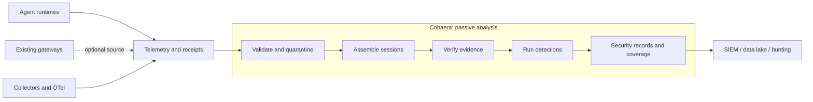

<!--
  Copyright 2026 Imran Hafeez
  SPDX-License-Identifier: Apache-2.0
-->

# Cohaera

**Passive security monitoring and detection engineering for AI agent activity.**

Cohaera reads exported agent telemetry out of band, reconstructs sessions,
verifies the evidence, runs deterministic detections, and emits records for a
SIEM or investigation workflow. Think Zeek for agent telemetry. It is
pre-alpha research software; the comparison describes the operating model,
not the maturity.

**It is not a gateway.** It does not proxy prompts, approve tool calls, block
actions, or sit in an agent's availability path. A gateway can be one
telemetry source; Cohaera does not need one.


```mermaid
flowchart LR
    A[Agent runtimes] --> T[Telemetry and receipts]
    G[Existing gateways] -. optional source .-> T
    C[Collectors and OTel] --> T
    T --> V[Validate and quarantine]
    V --> S[Assemble sessions]
    S --> E[Verify evidence]
    E --> D[Run detections]
    D --> O[Security records and coverage]
    O --> X[SIEM / data lake / hunting]

    subgraph Cohaera[Cohaera: passive analysis]
      V
      S
      E
      D
      O
    end
```

## The one idea

Agent logs raise two questions. Did the session contain suspicious behaviour,
and was there enough trustworthy evidence to answer that? Most pipelines
answer the first and assume the second. Cohaera keeps them apart: every check
returns `evaluated`, `degraded`, or `not_evaluated` with machine-readable
reasons, and missing evidence can never become a clean result.

## Try it in five minutes

Python 3.10 to 3.14, no network, no package installation.

```bash
git clone https://github.com/404SecNotFound/Cohaera.git
cd Cohaera

python3 lab/local/run.py --check      # six states of one workflow, end to end
cat lab/local/runs/latest/RESULTS.md

python3 lab/ch06/run.py --check       # nine tampering conditions on one signed stream
```

The **[operator guide](docs/OPERATOR-GUIDE.md)** walks through the inputs,
the output, and the code path.

## Score your own telemetry

```bash
python3 -m venv .venv && source .venv/bin/activate
python -m pip install -e .
python tests/make_fixtures.py

cohaera score tests/fixtures/suspect.jsonl \
  --baseline tests/fixtures/benign.jsonl > verdicts.jsonl
```

Verdicts go to stdout as JSONL; findings and coverage gaps go to stderr.
Stronger conclusions need stronger inputs: a capability manifest, a trust
store for collector and approval keys, the stream and approval ledgers, and a
freshness bound. Input today is observra-shaped JSONL. Fields read, record
emitted, exit codes and every flag are in **[docs/REFERENCE.md](docs/REFERENCE.md)**.
To make your own runtime emit telemetry Cohaera can verify, see
**[docs/EMITTING.md](docs/EMITTING.md)**.

## Detections

| ID | Security question |
|---|---|
| **CH01** `sequence_order` | Is the tool sequence novel relative to an operator-supplied benign grammar? |
| **CH02** `concealment_gap` | Did a consequential action succeed without appearing in the agent's final account? |
| **CH03** `untrusted_to_consequential` | Did consequential work follow observed untrusted content? |
| **CH04** `guardrail_overrun` | Did work continue after a guardrail, and was a declared blocking control bypassed? |
| **CH05** `unpaired_calls` | Did a consequential call start without a terminal event? |
| **CH06** `evidence_integrity` | Are sequence, chain, signatures, freshness, replay, and fork state admissible? |
| **CH07** `effect_contradiction` | Does a claimed failure conflict with a receipt, or does the receipt fail to bind? |

Each verdict carries findings, an `evidence_status` from `verified_complete`
to `inadmissible`, a coverage contract per check, and provenance. Portable
Sigma rules, LogRhythm AIE specifications and an Exabeam field map ship in
`content/`, and every field they reference is machine-tested against emitted
output.

## Evidence before claims

The behavioural detections are too noisy for operational alerting today.

| Measure | Current result |
|---|---:|
| False positives per 1000 **benign** sessions | **420.4** |
| Projected precision at 0.1% attack prevalence | **0.238%** |
| Ways to defeat it | **29** catalogued, of which **27** still work |
| External result | 375 third-party attack sessions scored, zero detections |

The external zero is a layer mismatch: those traces do not carry the content
and evidence the checks read. It is not evidence that the detections work on
outside traffic. Cohaera is an assurance control, not an adversarial one: it
reads what the observed agent chose to emit, says how trustworthy that record
is, and cannot by itself say whether the agent lied.

- Tests, 1574 collected across unit, hostile-input, content, lab, and
  regression coverage. A few skip by design where their data is absent, such
  as commit history on a shallow clone.
- Sigma content pack, 15 rules, validated and conformance-tested against real
  emitted fields.
- Adversarial self-test, 35 rows in [EVASION.md](EVASION.md): 29 constructed
  evasions and 6 remedies.

Read the [evaluation card](eval/EVALUATION-CARD.md) before using a behavioural
finding as an alert, and [EVASION.md](EVASION.md) before treating the evidence
mechanisms as a trust boundary.

## Roadmap

- [ ] Define a stable 1.0 activity-record family for sessions, tools, evidence, coverage, and notices
- [ ] Add streaming session state with watermarks while preserving deterministic replay
- [ ] Add passive adapters for OpenTelemetry and additional exported agent telemetry
- [ ] Expand content around identity, delegation, credentials, data movement, tool supply chain, and cross-session campaigns
- [ ] Measure on independently generated traces and complete a live SIEM/Exabeam workflow

Milestones, gates, non-goals and the claims policy are in
[docs/DIRECTION.md](docs/DIRECTION.md). Cohaera is an independent consumer of
observra's JSONL and complements, rather than replaces, Exabeam Agent Behavior
Analytics; [docs/EXABEAM-STACK.md](docs/EXABEAM-STACK.md) draws the boundary.

## Repository map

```text
src/cohaera/       ingestion, session model, evidence verification, checks, CLI, emitter
lab/local/         executed end-to-end lab; start here
lab/ch06/          signed-stream conformance matrix and independent baseline
demo/              two small scenario demonstrations
eval/              synthetic corpus, runner, and generated evaluation card
content/           Sigma, LogRhythm AIE, Exabeam mapping, capability manifest
docs/              operator guide, reference, direction, threat model, trust design
tests/             unit, hostile-input, content, evasion, lab, and CI contracts
```

The [documentation map](docs/README.md) indexes everything else.

## License

Apache-2.0. See [LICENSE](LICENSE) and [NOTICE](NOTICE).
